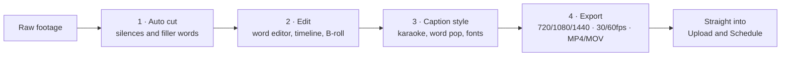
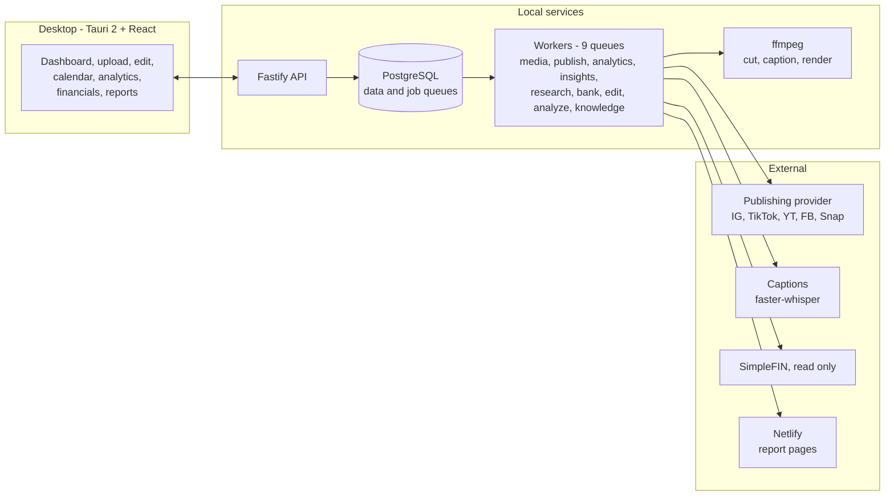

<div align="center">


# Toreroflow

**The desktop command center for a short-form video agency · by Torerone**

One place to cut a video, schedule it to every platform, watch what it did, bill for it,
and hand the client something worth reading.

<br/>


<br/>


<sub>Screenshots use a placeholder brand. No client of ours appears in this repository.</sub>

</div>

---

<div align="center">

###  &nbsp; The Edit tab

**The editing app moved inside.** Drop raw footage in and leave with a captioned,
cut, ready-to-post video, without opening a second program or paying a second
subscription.

</div>

Three areas behind one tab, each of which used to be somebody else's product.

<table>
  <tr>
    <td width="33%" valign="top"><b>Studio</b><br/><sub>Cut a video by editing its words</sub><br/><br/>Footage comes in and is transcribed to the word. Auto cut strips silences and filler. Delete a word in the transcript and the footage goes with it. Then a timeline for B-roll, a caption style, and a render.</td>
    <td width="33%" valign="top"><b>Analyze</b><br/><sub>A video that scores itself</sub><br/><br/>Hook, retention, payoff and a peak score, with the key moments marked on the video and named. An action plan for the next cut, and spin-off ideas from what already worked.</td>
    <td width="33%" valign="top"><b>Ideas</b><br/><sub>An ideas desk that knows the brand</sub><br/><br/>Hooks, scripts and shot lists for the brand's own niche, grounded in a knowledge base you drag files into. Brainstorm threads that are still there tomorrow.</td>
  </tr>
</table>



**What it does not pretend to know.** No platform hands out per-second retention for a
video that has not been posted, so the analyzer never implies it has any. The scores are
an honest read of the content itself, and the screen says so.

**It is not a separate island.** Videos the Account Overview plan says to make land in the
Ideas list tagged with where they came from, so the plan and the ideas desk are one system
rather than two lists that disagree.

---

## Every section, and what it does

The sidebar has eleven sections in four groups. This is what each one is for, and what it
deliberately will not do.

### 

| Section | In one line |
|---|---|
| **Dashboard** | Every brand's results on one card each, and a click through to the full picture. |
| **Financials** | What came in, what went out, what is left, per month and per brand. |
| **Account Overview** | What needs you today across every brand, and the plan for what to do next. |

<details>
<summary><b>The detail</b></summary>

<br/>

**Dashboard.** The first screen after sign-in. One results card per enrolled brand with the
figures that matter this month, so the answer to "how is everyone doing" does not require
opening eleven tabs.

**Financials.** Money in and money out, per month and per brand, with invoices rendered as
PDFs. Monthly pricing set on a client flows straight into the math here. Tax sits alongside
it: what to set aside on this year's profit, federal and state, with every state rate
editable because a built-in table goes stale each January. A read-only bank feed through
SimpleFIN puts the real balance next to the figures entered by hand. **Nothing in this
section can move money.** The bank provider has one endpoint and it is a GET.

**Account Overview.** The triage screen. It says how many brands need something and what,
and it holds the "what to do next" plan: a one-page brief written to the client in plain
words, built on their own numbers and on what the accounts they said they want to be like
are actually posting. Generating it runs in the background, so the screen is not a place
you have to sit and wait.

</details>

### 

| Section | In one line |
|---|---|
| **Upload & Schedule** | Drag a video in and send it to any mix of platforms, with the options each one really supports. |
| **Edit** | Studio, Analyze and Ideas. Cut it, score it, and work out what to make next. |
| **Calendar** | Day, week and month, with a padlock on anything that can no longer move. |
| **Carousels** | Write the slides from a brand's knowledge base and export the CSV Canva bulk create wants. |
| **Workflows** | Saved fan-out rules for reposting one upload across platforms. |

<details>
<summary><b>The detail</b></summary>

<br/>

**Upload & Schedule.** The original is kept untouched and a web-safe copy is made for
everything else. The video is transcribed, and a name and description get drafted from what
it actually says. One name and one description cover every platform, with YouTube's own
title and description behind a toggle, because YouTube is the only one that works that way.

Per-platform options are the ones the platform genuinely supports, not a lowest common
denominator: Instagram gets reels with a cover frame you scrub to, collaborators, a pinned
first comment, trial reels, and a story as a second post rather than a hidden setting.
YouTube gets visibility, made-for-kids, category, playlist, a pinned first comment, the AI
label, and a related video picked from the channel's own catalogue.

**Edit.** The three areas above. Studio is a four-step run from raw footage to a rendered
file: auto cut, word editor and timeline, caption style, export at 720p through 1440p, 30
or 60fps, MP4 or MOV, with bitrate presets and the file size shown before you commit.
Analyze scores a video and marks the moments. Ideas writes hooks, scripts and shot lists
grounded in a knowledge base you drag files into. Rendering happens on the server, so the
window is free while it works.

**Calendar.** Drag a scheduled post to another day. Anything posted, or going out right now,
is locked and carries a padlock that says why. A legend across the top explains every
status colour, because a colour nobody can decode is decoration.

**Carousels.** A brand's knowledge base in, slide copy out, then a CSV that Canva bulk
create turns into a finished set. Carousels schedule through the same uploader as video
rather than a separate path.

**Workflows.** Fan-out rules are saved here, and **nothing runs them yet**. A video only
ever goes to the platforms ticked at the moment it is scheduled. That is stated on the
screen too: a rule that silently does not fire is worse than no rule.

</details>

### 

| Section | In one line |
|---|---|
| **Analytics** | Views, watch time, followers and engagement per platform, over any range. |
| **Reports** | A permanent page per brand on the agency's own domain, plus the PDF. |

<details>
<summary><b>The detail</b></summary>

<br/>

**Analytics.** A tab per connected network plus an overall view, over 30, 60, 90 days or
all time. Every figure on the screen narrows to the platform selected. Behind it sits a
rolling store of every post we have ever seen, so all-time boards survive the provider's
one-year window, and lifetime YouTube history is read from YouTube itself rather than the
provider's recent slice.

A metric a platform does not report is shown as unavailable, never as a zero. Nobody saved
it and nobody could save it are different facts, and printing zero for the second one is a
lie a client would reasonably act on.

**Reports.** Two steps on purpose: Update pulls fresh numbers and rebuilds the page, Publish
is what the client can see. Updating never changes what is already live. A brand's link is
assigned once and never regenerated, because that link may already be in an inbox. Published
pages refresh on their own at month end, and only for brands already published once, because
putting a client's numbers on the public web is a decision an operator makes rather than a
timer. Weekly reports ship beside monthly ones. Thumbnails are embedded rather than linked,
so a page does not rot into broken images the week after it is sent.

</details>

### 

| Section | In one line |
|---|---|
| **Settings** | App behaviour, connected accounts, client onboarding, and the operator session. |

<details>
<summary><b>The detail</b></summary>

<br/>

Connect a brand's platforms, set its monthly price, adjust the video quota per format, and
manage the operator session. Client onboarding lives here as well: one link a new client
opens on their phone that collects their details and connects their accounts, and the app
pulls the reply when asked.

The Ship card deploys the server. It asks, it does not act on its own, and the only power
the API has in that exchange is writing one file for a watcher on the host to pick up.

</details>

---

## The app

<table>
  <tr>
    <td align="center" width="50%"><b>Content calendar</b><br/><sub>Status at a glance, and a padlock on anything that can no longer move</sub><br/><br/></td>
    <td align="center" width="50%"><b>Financials</b><br/><sub>Money in, money out, tax to set aside, the year-end export</sub><br/><br/></td>
  </tr>
  <tr>
    <td align="center" width="50%"><b>Carousels</b><br/><sub>A brand's knowledge base, and the words written from it</sub><br/><br/></td>
    <td align="center" width="50%"><b>What the client receives</b><br/><sub>Plain words, their numbers, and what works for the accounts they follow</sub><br/><br/></td>
  </tr>
</table>

The palette, the glass and the coral come from [torerone.com](https://torerone.com), so the app and
the site read as one thing. Dropdowns are the app's own component rather than the operating
system's: a native list takes no radius, no blur and no animation on any platform.

---

## How it is put together

Today it runs as a desktop shell talking to a local API, with Postgres in Docker.



Publishing sits behind an adapter with a dry-run provider, so the engine can move from a unified
provider to direct platform APIs without touching the rest of the app. Competitor research sits
behind the same kind of interface, for the same reason.

Every job queue runs on Postgres. Redis used to hold them and is gone, because there is no
official Redis build for Windows and Postgres has to be there anyway. The worker re-queues
anything the calendar still expects on every boot, so the queue can be replaced underneath
the app without a scheduled post going quiet.

**Next up: making it standalone.** The installer today builds a window that expects that local API,
so it needs the repo and Docker on the machine. Embedding the database and compiling the API into
a sidecar is the rest of the work that turns this into something you just download.

---

## Monorepo

```
apps/
  desktop/     Tauri v2 + React client, the app itself
  api/         Fastify API
  worker/      background workers: media, publish, analytics, insights,
               research, bank, edit, analyze, knowledge
  captions/    Python faster-whisper service, word-level timestamps
packages/
  core/        pure logic and shared types, each with a runnable check beside it
  db/          Prisma schema, hand-written migrations, the Postgres job queue
  publishers/  publishing adapter, provider, dry-run
  media/       encode profiles, ffmpeg helpers, edit rendering, PDF rendering
assets/        document templates and the embedded brand fonts
infra/         docker-compose: Postgres 16
```

### Checks, not a test framework

There is no test runner in here on purpose. Anything worth defending has a `*.check.ts` beside it
that runs under `tsx` and fails loudly:

```bash
pnpm -r test
```

Forty-seven of them, covering what would be expensive to get wrong: money arithmetic, Schedule C
line numbers, encryption at rest, a spending ceiling that can never be exceeded, the edit decision
list that drives every render, and one that reads the stylesheet and fails if any animation would
cost a layout or a repaint.

---

## Getting started

**Prereqs:** Node 20+, pnpm, Docker Desktop, Rust toolchain, ffmpeg.

```bash
pnpm install
cp .env.example .env      # fill in the keys you need
pnpm infra:up             # Postgres
pnpm db:migrate
pnpm dev:api              # API on http://localhost:4700
pnpm --filter @toreroflow/desktop tauri dev
```

Or run `start.cmd` at the repo root, which does all of that in order.

---

<div align="center">
  <sub>Built by <b>Torerone LLC</b></sub>
</div>
