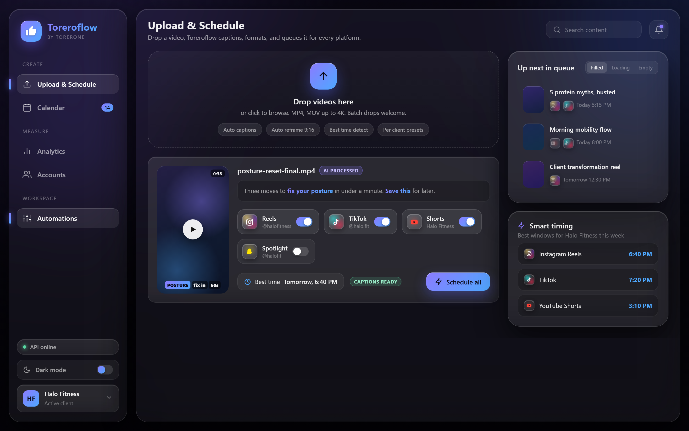
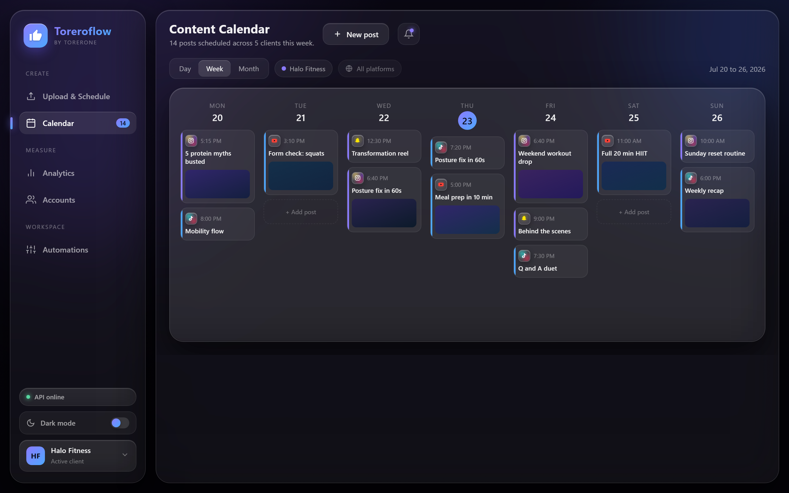
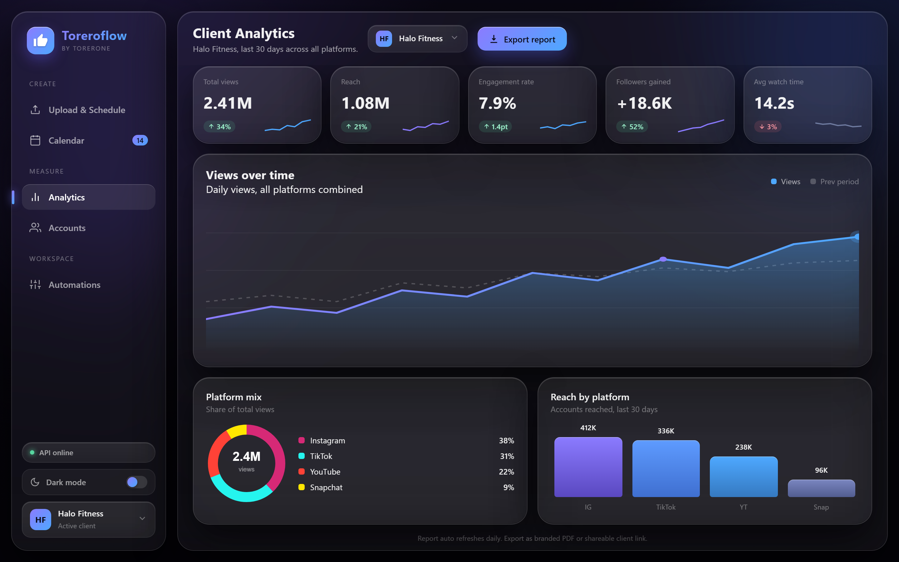
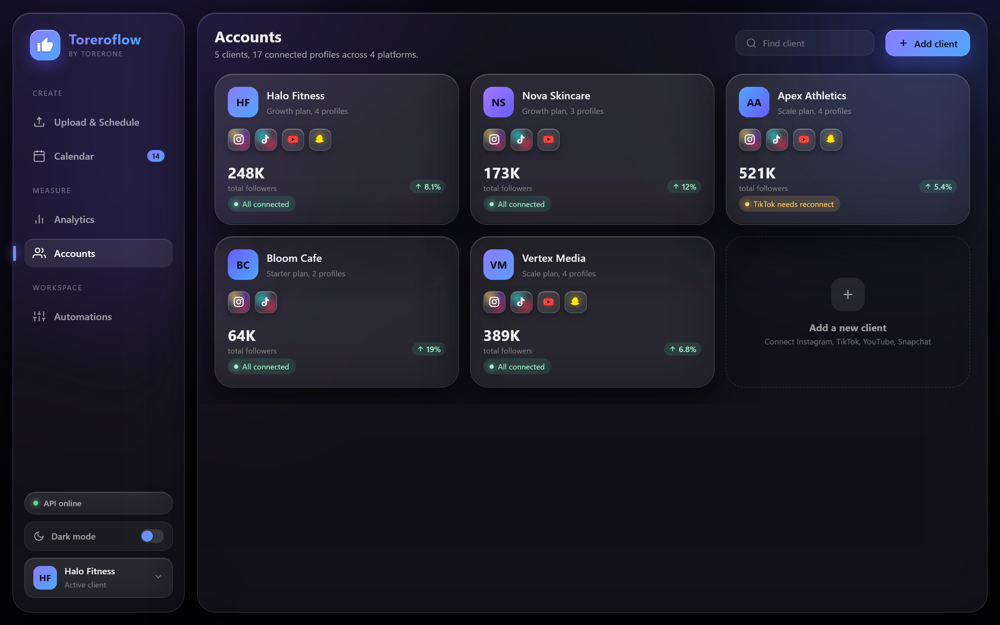
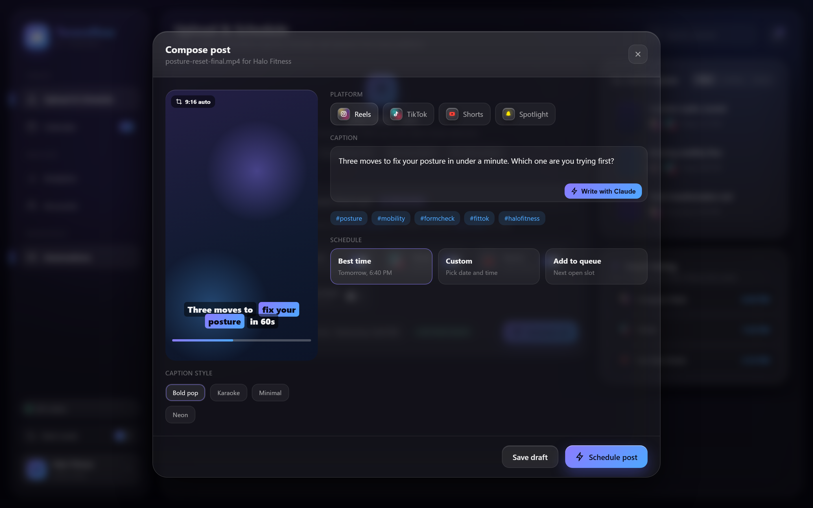
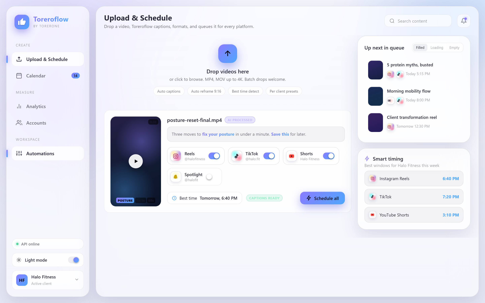
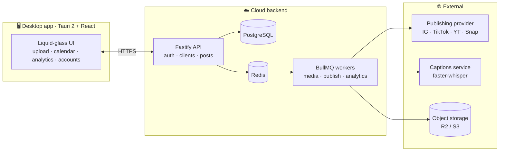

<div align="center">


# Toreroflow

**The social media command center · by Torerone**

Drop a video in → it gets captioned, reframed to 9:16, scheduled at the best time, and posted to
**Instagram · TikTok · YouTube · Snapchat** for every client — with all the analytics rolled up
into client-ready reports.

<br/>


<br/>



</div>

---

## ✨ What it does

| | Feature | Status |
|---|---|---|
| 🎛️ | **Multi-account management** — clients, connected profiles, connection health | 🟣 UI live (M0) · wiring in M1 |
| 🎬 | **Video intake** — drag & drop, local media library | ⚪ M2 |
| 💬 | **Auto captioning** — transcription + styled burned-in captions (Bold pop, Karaoke, Minimal, Neon) | ⚪ M2 |
| 📐 | **Auto formatting** — per-platform 9:16 reframe & transcode profiles | ⚪ M2 |
| ✍️ | **AI captions & hooks** — Claude drafts per-platform copy, human approves | ⚪ M2 |
| 🗓️ | **Scheduling** — calendar & queue, days ahead, per client & platform | ⚪ M3–M4 |
| 🚀 | **Auto publishing** — cloud workers post at the scheduled moment, with retries | ⚪ M3 |
| ⏰ | **Best-time engine** — posting windows computed from each account's own history | ⚪ M5 |
| 📊 | **Analytics** — KPIs, trends, platform mix, top posts, branded PDF exports | 🟣 UI live (M0) · data in M5 |

## 🖥️ The app

<table>
  <tr>
    <td align="center"><b>Content Calendar</b><br/></td>
    <td align="center"><b>Client Analytics</b><br/></td>
  </tr>
  <tr>
    <td align="center"><b>Accounts</b><br/></td>
    <td align="center"><b>Post Composer</b><br/></td>
  </tr>
</table>

<details>
  <summary>☀️ <b>Light mode</b> (full theme parity — click to expand)</summary>
  <br/>
  
</details>

## 🏗️ Architecture

The desktop app is the control room; a small always-on cloud backend is the engine that actually
posts on schedule and pulls analytics — a closed laptop can't fire a 6:40 PM post, a server can.



Publishing sits behind an **adapter interface** with a dry-run provider, so the engine can move
from a unified provider (v1) to direct platform APIs later without touching the rest of the app.

## 🧰 Monorepo

```
apps/
  desktop/     Tauri v2 + React client (the app itself)
  api/         Fastify API — health + operator auth
  worker/      BullMQ workers (M2+)
  captions/    Python faster-whisper microservice (M2+)
packages/
  db/          Prisma schema · 12 entities · migrations
  core/        shared types, zod schemas, design tokens
  publishers/  publishing adapter + dry-run provider
  media/       per-platform encode profiles, ffmpeg helpers (M2+)
infra/         docker-compose: Postgres 16 + Redis 7
design/        liquid-glass prototype — the visual source of truth
```

## 🚀 Getting started

**Prereqs:** Node 20+, pnpm, Docker Desktop, Rust toolchain (for the desktop shell).

```bash
pnpm install
cp .env.example .env      # fill in secrets
pnpm infra:up             # Postgres + Redis containers
pnpm db:migrate           # apply migrations
pnpm dev:api              # API on http://localhost:4700
pnpm --filter @toreroflow/desktop tauri dev   # launch the app
```

## 🗺️ Roadmap

- [x] **M0 · Scaffold & shell** — monorepo, DB schema, auth API, full UI port ✅ `v0.1.0`
- [ ] **M1 · Clients & connections** — client CRUD, publishing provider, OAuth per platform
- [ ] **M2 · Upload & media pipeline** — storage, transcription, AI captions, 9:16 renders
- [ ] **M3 · Scheduling & publishing** — delayed jobs, dry-run → sandbox → live, retries
- [ ] **M4 · Calendar** — drag-to-reschedule across week & month views
- [ ] **M5 · Analytics** — daily metric ingestion, dashboards, branded PDF exports
- [ ] **M6 · Package & polish** — signed installers, auto-update, theme & state polish

## 📝 Changelog

Every milestone lands as a tagged release with its acceptance checks — see **[CHANGELOG.md](CHANGELOG.md)**.

---

<div align="center">
  <sub>Built by <b>Torerone</b> · shipped with <a href="https://claude.com/claude-code">Claude Code</a></sub>
</div>
