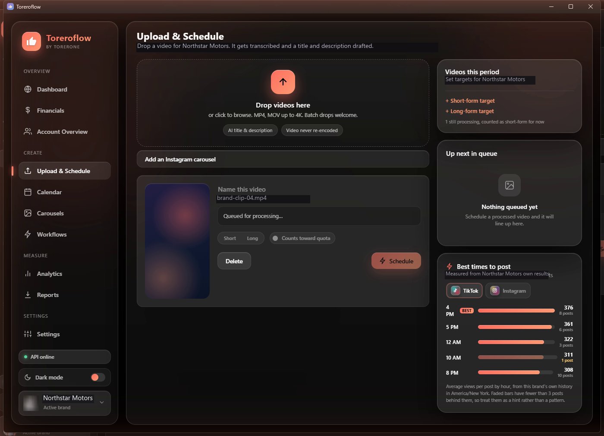
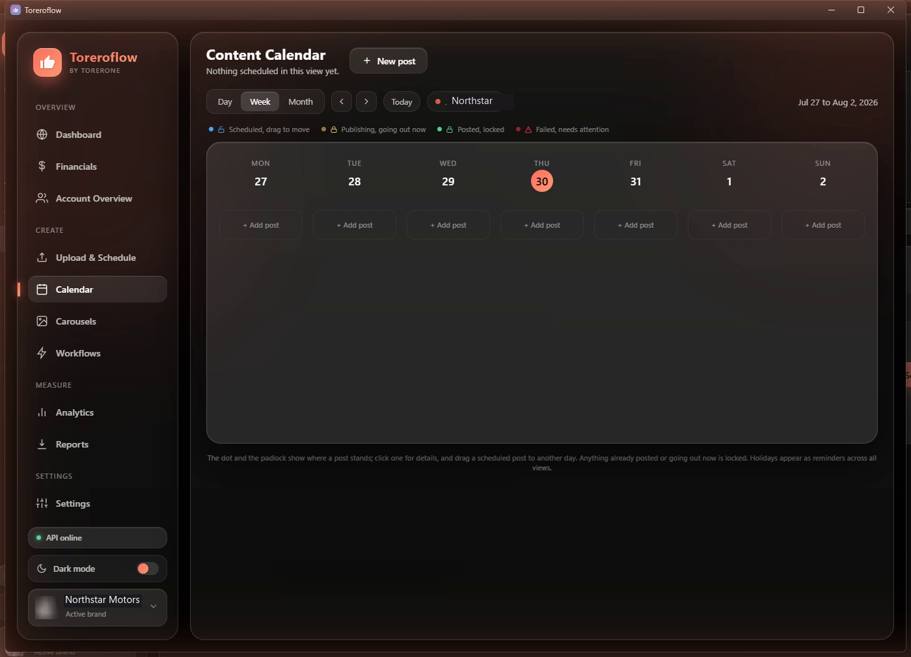
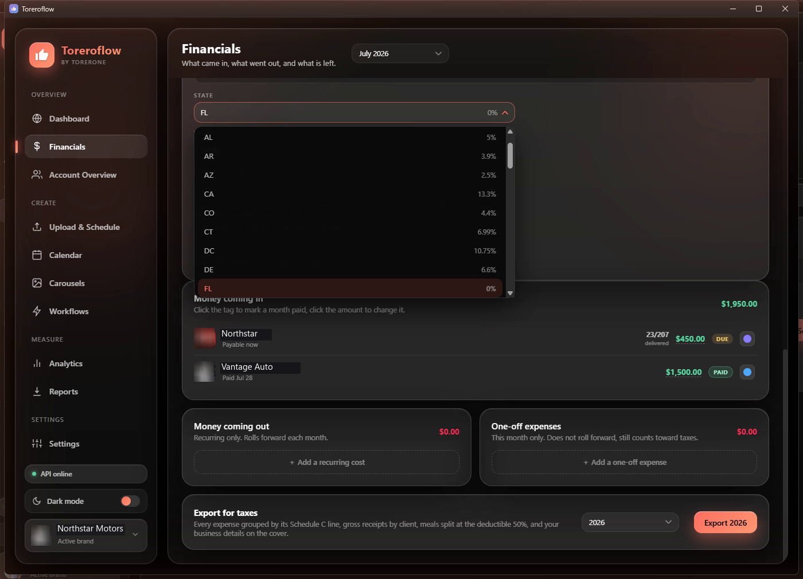
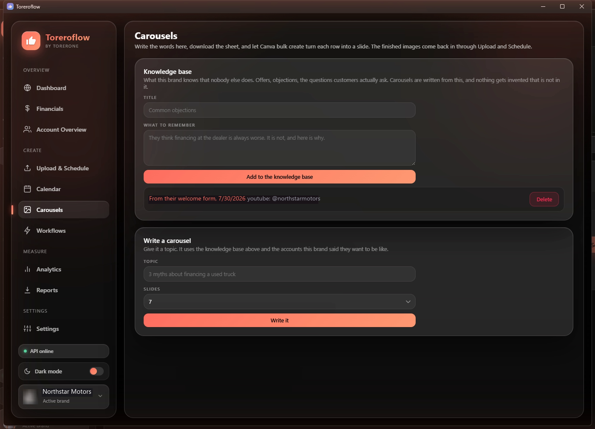
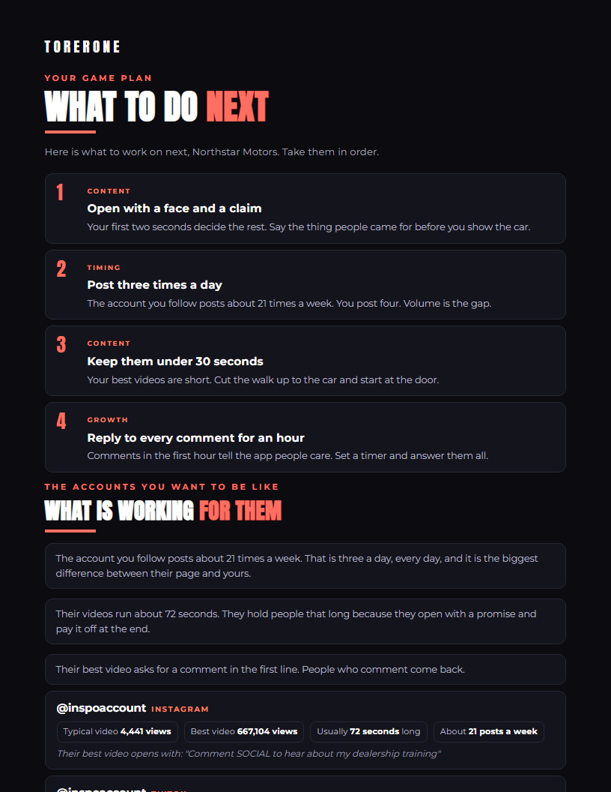
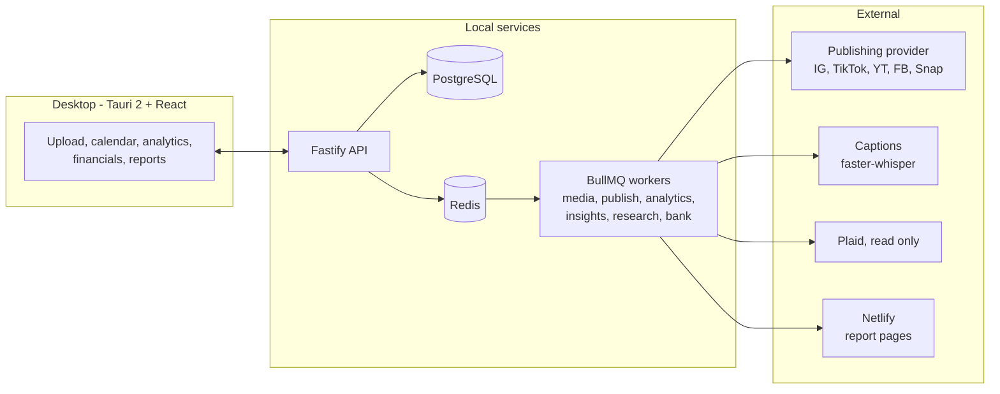

<div align="center">


# Toreroflow

**The desktop command center for a short-form video agency · by Torerone**

One place to upload a video, schedule it to every platform, watch what it did, bill for it,
and hand the client something worth reading.

<br/>


<br/>



<sub>Screenshots use a placeholder brand. No client of ours appears in this repository.</sub>

</div>

---

## What it does

Drop a video in. It gets transcribed, a name and description get drafted, and you schedule it to
Instagram, TikTok, YouTube, Facebook and Snapchat in one pass, with the per-platform options each
one actually supports. The numbers come back on their own, and turn into a report the client can
open on their phone.

### Create

| | |
|---|---|
| **Upload and schedule** | Drag a video in, keep the original untouched, and send it to any mix of platforms. One name, one description, and YouTube's own title and description behind a toggle, because YouTube is the only one that works that way. |
| **Instagram options** | Reels with a cover frame you scrub to, collaborators, a pinned first comment, trial reels, and the same post to a story as a second post rather than a setting. |
| **YouTube options** | Visibility, made-for-kids, category, playlist, a pinned first comment, the AI label, and a related video picked from the channel's own catalogue. |
| **Content calendar** | Day, week and month. Drag a scheduled post to another day; anything posted or going out now is locked and says so. |
| **Carousels** | Write the words from a brand's own knowledge base, export the CSV, and let Canva bulk create turn each row into a slide. |

### Measure

| | |
|---|---|
| **Analytics** | Views, watch time, followers and engagement per platform, with a rolling store of every post we have ever seen so all-time boards survive the provider's one-year window. |
| **Reports** | A monthly page per brand at a permanent link on the agency's own domain, plus the PDF. |
| **What to do next** | A one-page plan written to the client in plain words, built on their numbers and on what the accounts they said they want to be like are actually posting. |
| **Competitor research** | Pulls what those accounts post, through a broker, logged out, never from a client's account. Every run declares a spending ceiling before it spends anything. |

### Run the business

| | |
|---|---|
| **Financials** | What came in, what went out, what is left, per month and per brand. Invoices as PDFs. Nothing in here can move money. |
| **Tax** | What to set aside on this year's profit, federal and state, with every state rate editable because a built-in table goes stale each January. |
| **Bank** | A read-only feed of the business account through Plaid, so money in and money out sit beside the figures entered by hand. |
| **Client onboarding** | One link a new client opens on their phone. It collects their details and connects their accounts, and the app pulls the reply when asked. |

---

## The app

<table>
  <tr>
    <td align="center" width="50%"><b>Content calendar</b><br/><sub>Status at a glance, and a padlock on anything that can no longer move</sub><br/><br/></td>
    <td align="center" width="50%"><b>Financials</b><br/><sub>Money in, money out, tax to set aside, the year-end export</sub><br/><br/></td>
  </tr>
  <tr>
    <td align="center" width="50%"><b>Carousels</b><br/><sub>A brand's knowledge base, and the words written from it</sub><br/><br/></td>
    <td align="center" width="50%"><b>What the client receives</b><br/><sub>Plain words, their numbers, and what works for the accounts they follow</sub><br/><br/></td>
  </tr>
</table>

The palette, the glass and the coral come from [torerone.com](https://torerone.com), so the app and
the site read as one thing. Dropdowns are the app's own component rather than the operating
system's: a native list takes no radius, no blur and no animation on any platform.

---

## How it is put together

Today it runs as a desktop shell talking to a local API, with Postgres and Redis in Docker.



Publishing sits behind an adapter with a dry-run provider, so the engine can move from a unified
provider to direct platform APIs without touching the rest of the app. Competitor research sits
behind the same kind of interface, for the same reason.

**Next up: making it standalone.** The installer today builds a window that expects that local API,
so it needs the repo and Docker on the machine. Embedding the database, dropping Redis and
compiling the API into a sidecar is the work that turns this into something you just download.

---

## Monorepo

```
apps/
  desktop/     Tauri v2 + React client, the app itself
  api/         Fastify API
  worker/      BullMQ workers: media, publish, analytics, insights, research, bank
  captions/    Python faster-whisper service
packages/
  core/        pure logic and shared types, each with a runnable check beside it
  db/          Prisma schema and hand-written migrations
  publishers/  publishing adapter, provider, dry-run
  media/       encode profiles, ffmpeg helpers, PDF rendering
assets/        document templates and the embedded brand fonts
infra/         docker-compose: Postgres 16 + Redis 7
```

### Checks, not a test framework

There is no test runner in here on purpose. Anything worth defending has a `*.check.ts` beside it
that runs under `tsx` and fails loudly:

```bash
pnpm --filter @toreroflow/core test
```

Thirty of them, covering what would be expensive to get wrong: money arithmetic, Schedule C line
numbers, encryption at rest, a spending ceiling that can never be exceeded, and one that reads the
stylesheet and fails if any animation would cost a layout or a repaint.

---

## Getting started

**Prereqs:** Node 20+, pnpm, Docker Desktop, Rust toolchain, ffmpeg.

```bash
pnpm install
cp .env.example .env      # fill in the keys you need
pnpm infra:up             # Postgres + Redis
pnpm db:migrate
pnpm dev:api              # API on http://localhost:4700
pnpm --filter @toreroflow/desktop tauri dev
```

Or run `start.cmd` at the repo root, which does all of that in order.

---

<div align="center">
  <sub>Built by <b>Torerone LLC</b></sub>
</div>
